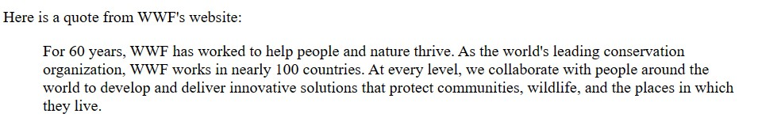
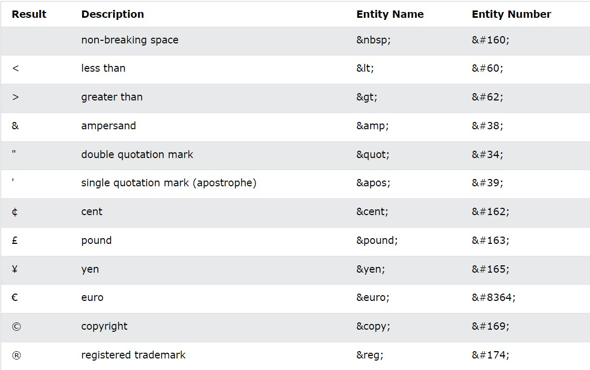

# HTML

```html
<!DOCTYPE html>
```
decleration for HTML5
- stands for Hyper Text Markup Language
- head: contain meta information about HTML page and the title of the page 
- body: container of all visible elements 
- ``never skip the end tag ``some HTML elements will display correctly, even if you forget the end tag, like paragraph, but not relay on that it will case alot of errors
## diffrence between absolute url & relative url
- absolute url
  - protocol + domain name + path
  - doesn't depend on current page
  - must be used if i link external resource
- relative url
  - only path 
  - depend on current page 
  - prefered to be used (if i change domain less update will be done)
- src have that to types to specify url
## XHTML VS HTML VS HTML5
- HTML5 > XHTML > HTML (better) 
## HTML STYLES
- text-align: define horizontal text aligning
## HTML formating
```html
<b>  Bold text </b>
<strong>  Important text </strong>
<i>  Italic text </i> 
<em>  Emphasized text </em>
<mark>  Marked text </mark> 
<small>  Smaller text </small>
<del>  Deleted text </del>
<ins>  Inserted text </ins> 
<sub>  Subscript text </sub>
<sup>  Superscript text </sup> 
```
- <b>  Bold text </b>
- <strong>  Important text </strong>
- <i>  Italic text </i> 
- <em>  Emphasized text </em>
- <mark>  Marked text </mark> 
- <small>  Smaller text </small>
- <del>  Deleted text </del>
- <ins>  Inserted text </ins> 
- <sub>  Subscript text </sub>
- <sup>  Superscript text </sup> 
## HTML Quotations
- define section that is qoauted from another sorce
```html
<p>Here is a quote from WWF's website:</p>
<blockquote cite="http://www.worldwildlife.org/who/index.html">
  For 60 years, WWF has worked to help people and nature thrive. As the
  world's leading conservation organization, WWF works in nearly 100
  countries. At every level, we collaborate with people around the world to
  develop and deliver innovative solutions that protect communities,
  wildlife, and the places in which they live.
</blockquote>
```


```html
<q>: defines a short quotation.
<abbr>: defines an abbreviation or an acronym
<address>: define contact information for the owner of document or artice, renders in italic
<cite>: define title of creative work, renders in italic
<bdo>: change text direction, show text in reverse
```
## css
- cascade mean any style applaied to parent will also applay to all children within this parent
## links
- target attribute
  - specify where to open linked document
  - _self: Default. Opens the document in the same window/tab as it was clicked
  - _blank: Opens the document in a new window or tab
  - _parent: Opens the document in the parent frame
  - _top: Opens the document in the full body of the window
## link
- to use button as a link you will need some js
- link to email address: Use mailto: inside the href attribute to create a link that opens the user's email program
``` html
<a href="mailto:someone@example.com">Send email</a>
```
## book mark
- use id to define bookmark in a page
- use href to link bookmark
```html
<h2 id="C4">Chapter 4</h2>
<a href="#C4">Jump to Chapter 4</a>
```
## image
- it is not inserted to website, it is linked to web page
- float attripute in style make image in the right or left of the text
- image map: make clickable ereas in the image to link that erea to another page, read that article for more information [link](https://www.w3schools.com/html/html_images_imagemap.asp)
- ### background image
  - background-size: cover; => make image cover entire page
  - background-attachment:fixed; => make sure entire element is always covered
- ### picture elemnt
  - allows you to display different pictures for different devices or screen sizes
  - *when to use picture element:*
  
    1- Bandwidth: If you have a small screen or device, it is not necessary to load a large image file. The browser will use the first source element with matching attribute values, and ignore any of the following elements.

    2- Format Support: Some browsers or devices may not support all image formats. By using the picture element, you can add images of all formats, and the browser will use the first format it recognizes, and ignore any of the following elements.
## favicon
- small image displayed next to page title in the browser page
## list
```html
Use the HTML <dl> element to define a description list
Use the HTML <dt> element to define the description term
Use the HTML <dd> element to describe the term in a description list
```
## iframe
- used to include a page in another one
## title 
- title of the web page is very important for search engines 
stop here [link](https://www.w3schools.com/html/html_layout.asp)
## html encoding
- any special chars will be encoding because they have special meaning in the url
- post method is more secure than get method and will get less time, data transmitted throw request body
- get take more time than post because of the time taking to include data throw url, that will be noticed for large data
## entities

## XHTML
- XML: markup language where all documents must be marked up correctly
- browsers ignore errors in html and try to display it, so XHTML come with more stricker error handling
## form
- The form-handler is typically a server page with a script for processing input data.(place which i send data to to make backend code, place in the action attribute)
- label: helps users who have difficulty clicking on very small regions (such as radio buttons or checkboxes) - because when the user clicks the text within the label element, it toggles the radio button/checkbox, and also it active the text box to can write in it
```html
<p>Choose your favorite Web language:</p>

<form>
  <label for="fname">First name:</label><br>
  <input type="text" id="fname" name="fname"><br>
  <label for="lname">Last name:</label><br>
  <input type="text" id="lname" name="lname">

  <input type="radio" id="html" name="fav_language" value="HTML">
  <label for="html">HTML</label><br>
  <input type="radio" id="css" name="fav_language" value="CSS">
  <label for="css">CSS</label><br>
  <input type="radio" id="javascript" name="fav_language" value="JavaScript">
  <label for="javascript">JavaScript</label>
</form>
```
- new input types for me
  - tel
```html
<input type="tel" id="phone" name="phone" pattern="[0-9]{3}-[0-9]{2}-[0-9]{3}">
<!-- pattern: specifies a regular expression that the input field's value is checked against, when the form is submitted. -->
```
- The formaction attribute works with the following input types: submit and image.
- The input formenctype attribute specifies how the form-data should be encoded when submitted (only for forms with method="post").