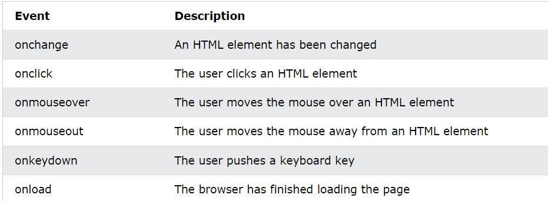
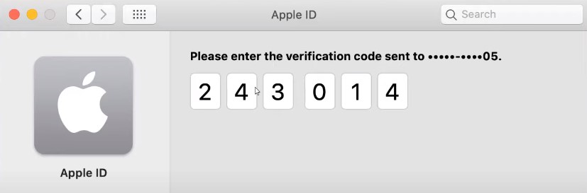

# DOM (Document object model)
## querySelector & querySelectorAll
- querySelector: select only the first element with the class name or tag name or id you pass
## innerHTML & textContent
```js
let myElement = document.querySelector(".js");

console.log(Element.innerHTML);
console.log(Element.textContent);

myElement.innerHTML ="Text from <spn>main.js</span> file"; // Text from main.js file
myElement.textContent ="Text from <spn>main.js</span> file"; // Text from <spn>main.js</span> file
```
## to select all images or files on forms or nay thing
- document.images => it return array of all images in the page
- acess => document.images[0].anyproperity
    ex  => document.images[0].id="pic";
## getAttribute & setAttribute
```js
let ele=document.querySelector("link");
ele.getAttribute('id');
ele.setAttribute('id','user');
```
## textNode
```js
let myElement = document.createElement("div");
let myText = document.createTextNode("Product One");

// Append Text To Element
myElement.appendChild(myText);

// Append Element To Body
document.body.appendChild(myElement);
``` 
## children & childNodes
- children: return elements only
- childNodes: return elements and text
## fistChild & firstElementChild
- fistChild: return elements and text
- firstElementChild: return elements only
- `for more Explanation`: 
  
firstChild returns the first child node of an element, which can be any type of node including text nodes, comment nodes, or element nodes. This means that if the first child of an element is a text node or a comment node, firstChild will return that node instead of the first element child.

Here's an example:

```html
<div id="myDiv">
  <!-- This is a comment node -->
  <p>This is the first element child</p>
  <p>This is the second element child</p>
</div>

<script>
  var firstChildNode = document.getElementById("myDiv").firstChild;
  console.log(firstChildNode); // Output: <!-- This is a comment node -->
</script>
```
In this example, firstChildNode will return a comment node, which is the first child of myDiv, but not the first element child.

On the other hand, firstElementChild returns the first child node of an element that is an element node. This means that it only returns the first element child of an element, and skips any text nodes or comment nodes.

Here's an example:

```html
<div id="myDiv">
  <!-- This is a comment node -->
  <p>This is the first element child</p>
  <p>This is the second element child</p>
</div>

<script>
  var firstElementChildNode = document.getElementById("myDiv").firstElementChild;
  console.log(firstElementChildNode); // Output: <p>This is the first element child</p>
</script>
```
In this example, firstElementChildNode will return the first element child of myDiv, which is the first p element.

So, to summarize, firstChild returns the first child node of an element, while firstElementChild returns the first child node of an element that is an element node.
## oncontextmenu
- right click
## Events
- all events starts with on 
- 


```js
let mybtn = document.getElementById("btn");
mybtn.onmouseleave=function(){
    console.log("Clicked");
}
```
## onblur event
- we may use it to make validation when user leave the text
## onsubmit
- it is to improtant for me as backend 
## preventDefault
- we use it to prevent event default action
```js
document.links[0].onclick = function (event) {
  console.log(event);
  event.preventDefault();
};
```
## Verification code
- it makes using focus & blur

## contains
- return true if class exists for that element 
- false if not
```js
let element = document.getElementById("my-div");
console.log(element.classList.contains("show"));
```
## add & remove & toggle class
- toggle => if exist remove
- => if not exist add        
```js
element.onclick= function(){
    element.classList.add("add-one","add-two");
    element.remove("add-one");
    element.toggle("add-one");
}
```
## cssText
```js
element.style.cssText = "font-weight: bold; color: green;";
```
## removeProperty & setProperty
```js
element.style.removeProperty("color");
element.style.setProperty("font-size",'40px','important');
```
## DOM Traversing 
- nextSibling: This property returns the next sibling node of an element, which can be any type of node including text nodes, comment nodes, or element nodes. If there is no next sibling node, it returns null.

- previousSibling: This property returns the previous sibling node of an element, which can be any type of node including text nodes, comment nodes, or element nodes. If there is no previous sibling node, it returns null.

- nextElementSibling: This property returns the next sibling element node of an element. If there is no next sibling element node, it returns null.

- previousElementSibling: This property returns the previous sibling element node of an element. If there is no previous sibling element node, it returns null.

- parentElement: This property returns the parent element node of an element.
```html
<div id="parent">
  <p>First child</p>
  <p>Middle child</p>
  <p>Last child</p>
</div>

<script>
  var middleChild = document.getElementById("parent").firstElementChild.nextElementSibling;
  console.log(middleChild); // Output: <p>Middle child</p>

  var lastChild = middleChild.nextElementSibling;
  console.log(lastChild); // Output: <p>Last child</p>

  var previousSibling = lastChild.previousSibling;
  console.log(previousSibling); // Output: #text (because there is a whitespace text node between <p>Last child</p> and </div>)

  var previousElementSibling = lastChild.previousElementSibling;
  console.log(previousElementSibling); // Output: <p>Middle child</p>

  var parentElement = lastChild.parentElement;
  console.log(parentElement); // Output: <div id="parent">...</div>
</script>
```
## addEventListener
- it give us error if i write wrong thing
```js
window.onload="osama"; // it is wrong statment but it doesn't give me any error
window.addEventListner("click","string"); // it will give me error
```
- the right to use events is to put object or function which will be did if i did that event
```js
function one (){
  console.log("clicked");
}
myp.onclick=one;
myp.addEventListner("click",one);
```
# BOM (browser object model)
## alert & promot & confirm
- read about them
## setTimeout
- it is used to do specific job after determined time
- arguments are passed to function after set time
```js
setTimeout(sayMsg,3000,username); //setTimeout(fun,time,additional params); 
function sayMsg(username){
  console.log(`I am message ${username}`);
}
```
## clearTimeout
- stop setTimeout
## setInterval
- call function every specific time
```js
setInterval(sayMsg,100);
```
## countdown
```html
    <div>5</div>
<script>
  let div=document.querySelector("div");
  function countdown(){
    div.innerHTML-=1;
    if(div.innerHTML==="0")
    {
        clearInterval(counter);
    }
  }
  let counter=setInterval(countdown,1000);
</script>
```
## href
## location.host & location.hostname
- host=> give you port number
- hostname=> give you hostname only
## hard video (window location object)
- this video is very hard for me
- i understan but need more calerify 
- [link](https://www.youtube.com/watch?v=6UZIhbPEUGg&list=PLDoPjvoNmBAx3kiplQR_oeDqLDBUDYwVv&index=106)
## href & replace
- replace remove current page from the history
## print page
- window.print();
## local storage
- storage of http protocol differ from https
- enctype differ from other page
- add data to storage to can use again even if i close window
- data i store is related with style only
```js
// set
window.localStorage.setItem("color","#F00");
window.localStorage.fontWeight="bold";
window.localStorage["fontSize"]="20px";

// remove one
window.localStorage.removeItem("color","#F00");

// remove all 
window.localStorage.clear();

// get
console.log(window.localStorage.getItem("color"));
document.body.style.backgroudColor=window.localStorage.getItem("color");
```
## localStorage & sessionStorage
- session delete when close browser page
- you can add form data to localStorage to store when you close browser or refresh
- it is preferred to add data of form to session
```js
document.querySelector(".name").onblur=function(){
  window.localStorage.setItem("input-name",this.value);
}
```