# Diffrence between metadata and stored data
## Metadata (database definition)
all iformation about database
- table name
- column name
- column data type
- constrains
- username
- password 
- user's privilleges
- log files
## stored database
- the actual stored data
# database users
- 1- system analysts
    - system analysis & requirement gathering
- 2- Database designer
    - create database design(conceptial schema)
- 3- database administrator
    - install DBMS
    - create DB schema & populate data
    - create users and authorize access to DB
    - maintain DB performance
- 4- application programmer
    - develope, test & debug the app
- 5- end user
# schemas
- schema is indepent
- if i change any schema, schema in higher level will not be affected
## external schema
- it contains data that end user see
- it is diffrent to can be used fr diffrent perposes of diffrent users
    ex: hr schema differ from users schema
## conceptial schema 
- contains tables and relations between data 
## physical schema
- where is its location in hard disk
- what is the memory token 
# models
## conceptial model
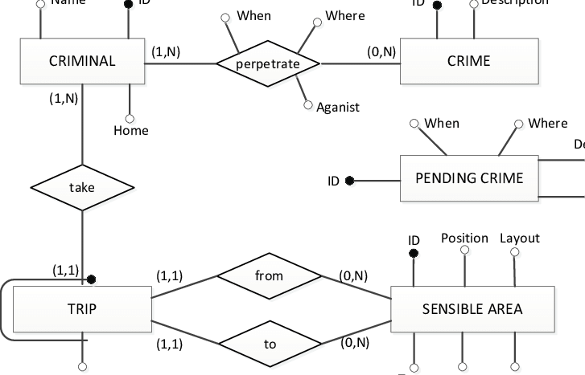
## physical model

## mappings
- proccess transform request between diffrent levels
- if i ask to show users data, mapping will transform request from external schema to conceptual and then mapping transfer request from conceptial to physical and then mapping to the same thing until return output to user
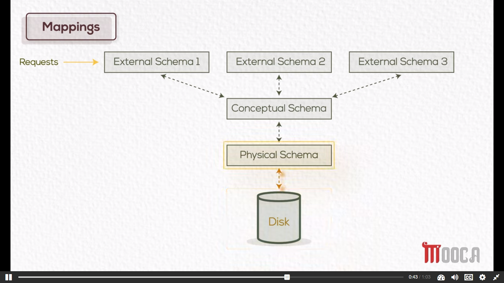
# data types and DBMS funtions
- the datatypes used where only text or number
- now they are multimedia function
- spetial data
- time series 
- data mining
    Data mining refers to the process of discovering patterns, relationships, and insights from large datasets stored in databases.
# database enviornment
In a centralized database environment, data is stored and managed in a single location or server. Here are three common types of centralized database environments:

1. Mainframe Environment:
   - In a mainframe environment, the database and its associated processes are hosted on a powerful mainframe computer.
   - All data processing tasks and operations rely on this central mainframe server.
   - Mainframe environments often have slower performance due to the heavy workload and resource limitations of a single server.
   - They can also be prone to single points of failure, meaning that if the mainframe server goes down, the entire system may become inaccessible.
   - Additionally, in a high-traffic scenario, response times can be relatively slow due to the server's processing limitations.

2. Client-Server Environment:
   - In a client-server environment, the database is hosted on a server, while clients (end-user devices) connect to the server to access and manipulate the data.
   - The server is responsible for managing the database, processing queries, and providing data to the clients.
   - This architecture allows for better distribution of processing power, as the server can handle resource-intensive tasks.
   - Client-server environments generally offer improved performance compared to mainframe environments, as processing power is distributed among multiple devices.

3. Internet Computing Environment:
   - In an internet computing environment, the database is accessible over the internet, allowing users to access and interact with the data remotely.
   - This environment leverages web-based technologies and protocols to enable data access and manipulation through web browsers or dedicated client applications.
   - Internet computing environments are highly scalable and flexible, as they can handle a large number of users and are not limited by physical infrastructure.
   - With the advent of cloud computing, internet computing environments can leverage cloud-based databases and storage solutions for improved reliability and scalability.

It's important to note that the choice of a centralized database environment depends on factors such as the organization's requirements, the volume of data, anticipated workload, and performance needs. Distributed or decentralized database architectures are also popular alternatives that offer different advantages in terms of scalability and fault tolerance.
# distriputed data base
1. # replication
## full replication
- store data in another system so if one is fail the other will work
## partial replication
- store part of data in another system, the most inmportant ones
2. # fragmentation
## horizontal 
## vertical
## hyprid
# ERD
## single/simple attribute
## multivalued attribute
- it takes multible values
- it is represented using double ovals as phone number
## composite attribute
- attribute devided into many parts as address
## derived attribute
- depend on other attribute as age
## unique indentifier
- underlined
## Entities
- ewe have two types of intities
1. ## strong entity
    - depend on her self
    - has unique attribute 
2. ## weak entity
    - depent on another entity
    - doesn't have any attribute can be unique attribute
    - it is represented using double line 
# Relation ships
1. ## Binary relationship
2. ## uniry/ rexursive relationship
    - relation beetween entity and itself
3. ## ternary relationship
# cardinality ration
- entites in the relationship related with each other with what ratio
- ex => 1:1 1:m m:n
- cardinality must be same on the same branch
- ex => if entity is related with another entity with M:any_thing, it must be related with other entites with M: any_thing  
# participation
- it depend on business senario
1. ## must
    - represented using double line
    - that enetity must have that relation
    - if i have only one employee out of that relationship, it mustn't be must 
2. ## may
    - represented using single line
    - that entity may have that relation and may not
# convert conceptual design into logical design
## domain
- intersection between columnn and row
## primary key
- unique
- not null
- if i have two or more unique values i choose must smaller one in memory,ex:num or text choose num
## multivalued arrtibutes
- make seperate table for each
- primary key: compination value and foreign key
## week entity
- primary key: compination foreign key and name
## mapping relation ships
`note: => ` attribute in the relationship follow foreign key
1. 1:N (binary) => i put primary key of one as foreign key in many
2. 1:N (unary) => i put primary key as foreign key in the same table
3. n:m => i put primary keys of both tables as foreign keys in a new table
4. 1:1 (may:must) => put primary key of may side as foreign key in must side
5. 1:1 (may:may) => has three cases to solve 
    1. put primary key as foreign key in any side (more recommended)
    2. make new table with both foreign keys 
6. 1:1 (must:must) => add all data of any tables as foreign keys to the other table (merge two tables)
7. ternary => make new table with all primary keys as foregin keys
# SQL (structured query language)
- with it i make physical design
## database constrains 
- primary key
- not null
- unique key 
- foreign integrity
- check (ex: check if data is between two values)
## SQL commmands
1. create table
    ```sql
    CREATE TABLE table_name (
    column1 datatype,
    column2 datatype,
    column3 datatype,
    ....
    );
    ```
2. add column
    ```sql
    alter table `table_name` add `column_name` column_type;
    ```
3. Remove column
    ```sql
    alter table `table_name` drop `column_name`;
    ```
4. Remove table
    ```sql
    drop `table_name`;
    ```
## object privillege
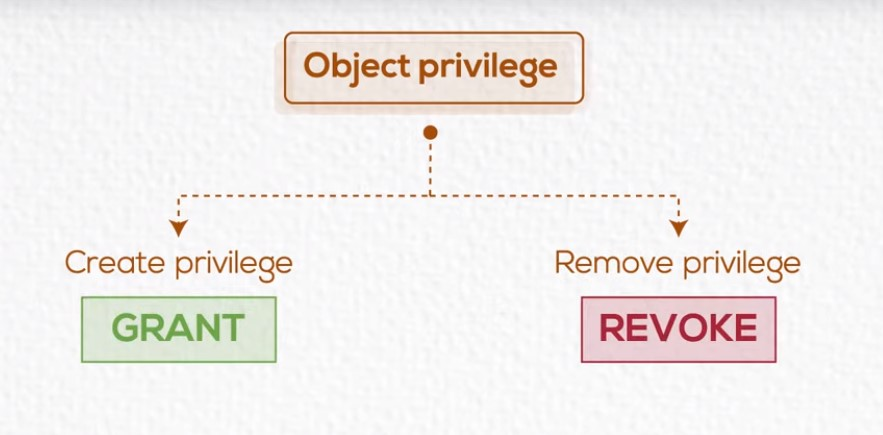
- `add privillege => ` use grant
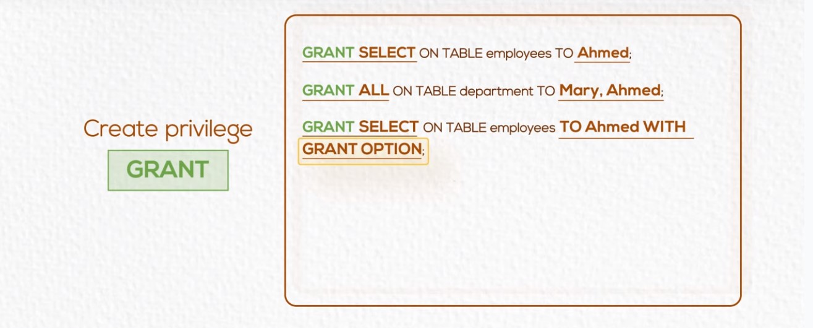
  - make ahmed can select 
  - give ahmed and mary all privilege of grant
  - make ahmed can share his privillege with other people 
- `remove privillege => ` use revoke
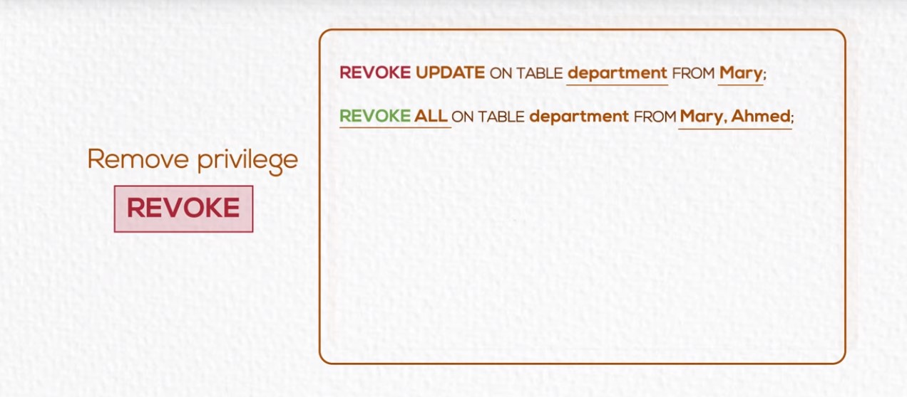
  - i remove update from mary's privillege
  - i remove all privilege from mary and ahmed
# DML 
## delete & insert
- work on record level
## update
- work on column level
## diffrence between truncate and delete
- truncate: only delete all table (can't use where clause)
- can not rollback so it is DDL but delete can be rolledback so it is DML
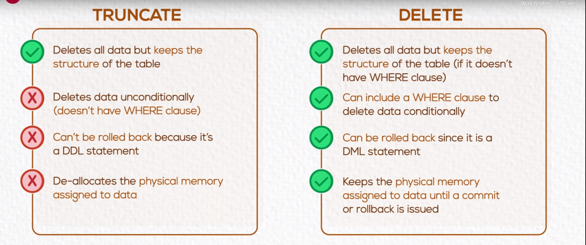 
## inner join
```sql
select fname,dname from employee,department where employee.dno=department.dno == 
select fname,dname from employee inner join department on employee.dno=department.dno
```
## outer join
- An outer join is a type of join operation in a relational database that combines rows from two tables based on a related column, including unmatched rows from one or both tables. It retrieves records that have matching values in the specified column(s), as well as any unmatched records from one or both tables.
- it return null if there is no data for specific field
```sql
select fname,dname from employee left outer join department on employee.dno=department.dno 
select fname,dname from employee right outer join department on employee.dno=department.dno 
select fname,dname from employee full outer join department on employee.dno=department.dno 
```
## self join
- if we have unary relation
```sql
select e.fname,s.fname from employee e, employee s where e.superssn=s.ssn 
```
## sub query
- we use (all) because that subquey will return more than one row
```sql
select * from employee where salary > all(select salary from employee where dno=10);
select * from employee where salary > any(select salary from employee where dno=10);
```
## group by
- seperate table into parts based on attribute i mentioned
```sql
select avg(salary) from employee group by dno having max(salary)>1800
```
- that query will return average of all employees with same department number
- `note` if i need to add condition here i use having instead of where because of aggregate function(max)
# view
- virtual containers or virtual tables in databases
- we trait it as table
```sql
create VIEW vw_work_hrs as select Fname,Lname,pname,hours from Employee,project,works_on where ssn=essn and pno=pnumber
```
## advantages of views
- restrict data access
- make complex queries easy 
- provide data independence
- present diffrent views of the same data
## types of view
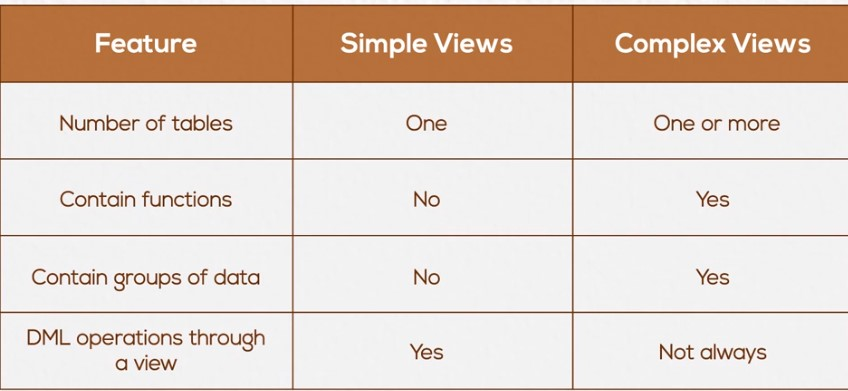
# indexes
- they are used to speed up retrival records in response to certain search condition
- may be defined on multiple columns
- can be created by user ot DBM
- are used and maintained by DBMS
- cause overhead on DML(insert, update, delete)
## when to use indexes
- retreving data heavily from table
- columns are used in search conditions or join conditions
- column contains large number of nulls
```sql
create index index_name on TableName (columnName)
create index emp_indx on Employee (salary)

Drop index index_name
Drop index emp_indx
```
# Normalization
Normalization is a database design technique used to eliminate data redundancy and improve data integrity in a relational database. It involves organizing data into multiple related tables and defining relationships between them. Here are some situations where normalization is commonly used:

1. Reducing data redundancy: When the same data is duplicated in multiple places, it can lead to inconsistencies and inefficiencies. Normalization helps in eliminating such redundancy by breaking down the data into smaller, atomic units and storing them in separate tables. This reduces the storage space required and ensures that updates or modifications to the data only need to be made in one place, improving data consistency.

2. Ensuring data integrity: Normalization helps enforce data integrity rules by eliminating the possibility of inconsistent or contradictory data. By defining relationships between tables and using primary and foreign keys, you can ensure that data dependencies are properly maintained. This improves the accuracy and reliability of the data stored in the database.

3. Simplifying data maintenance: Normalization simplifies the process of adding, updating, and deleting data. Since the data is organized into separate tables based on their logical relationships, modifications only need to be made in the relevant tables. This makes the database more maintainable and minimizes the chances of errors or inconsistencies.

4. Supporting scalability and flexibility: Normalized databases are generally more flexible and scalable. As the database grows and evolves, new tables can be added or modified without affecting the existing data structure. This allows for easier expansion and adaptability to changing business requirements.

It's important to note that while normalization has many benefits, there can be cases where denormalization (reintroducing redundancy) is appropriate to improve performance in specific scenarios. Denormalization should be carefully considered based on the specific needs and requirements of the application and database system.
## dunctional dependancy
- fully
- partially
- transitive
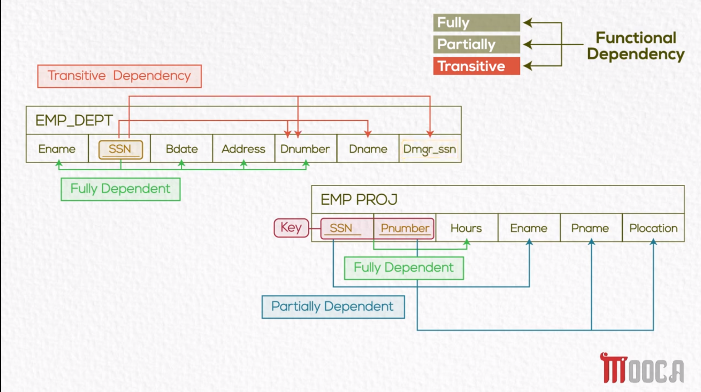
# normaliztion
- devide table into multible small tables 
## first normal value
doesn't contain 
1. multivalued attribute
2. repeating group (multible multivalued attribute)
3. composite attribute


## second normal form
1. must satisfy first normal form
2. doesn't contain partial dependency put it in new value
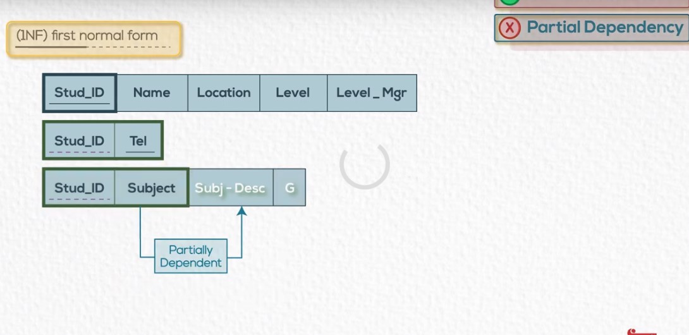
## third normal form
1. must satisfy second normal form
2. doesn't contain transitive depentancy(attribute depend in another attriute depend on primary key)
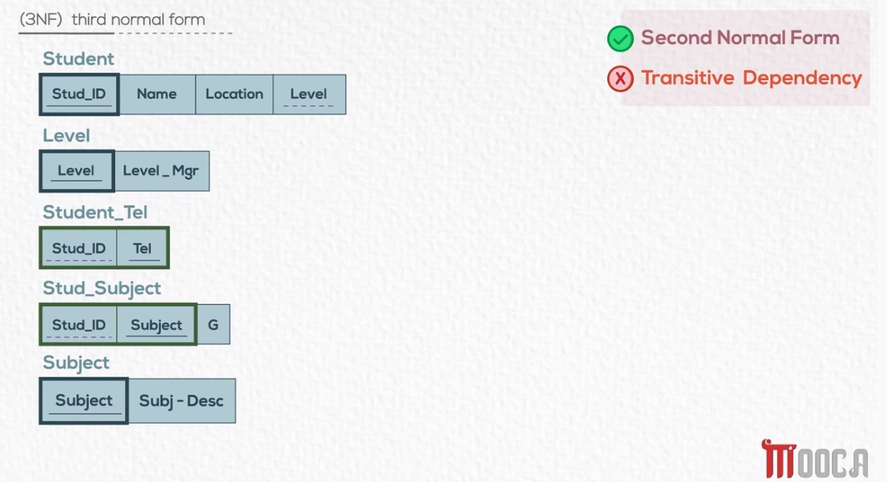
# conclusion
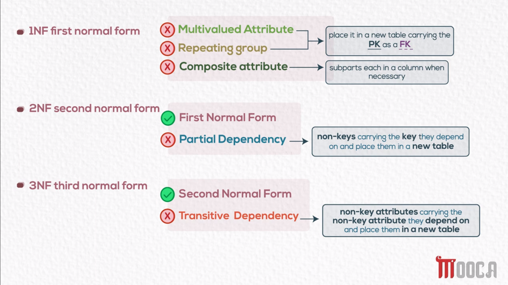
# mysql
- rational databse