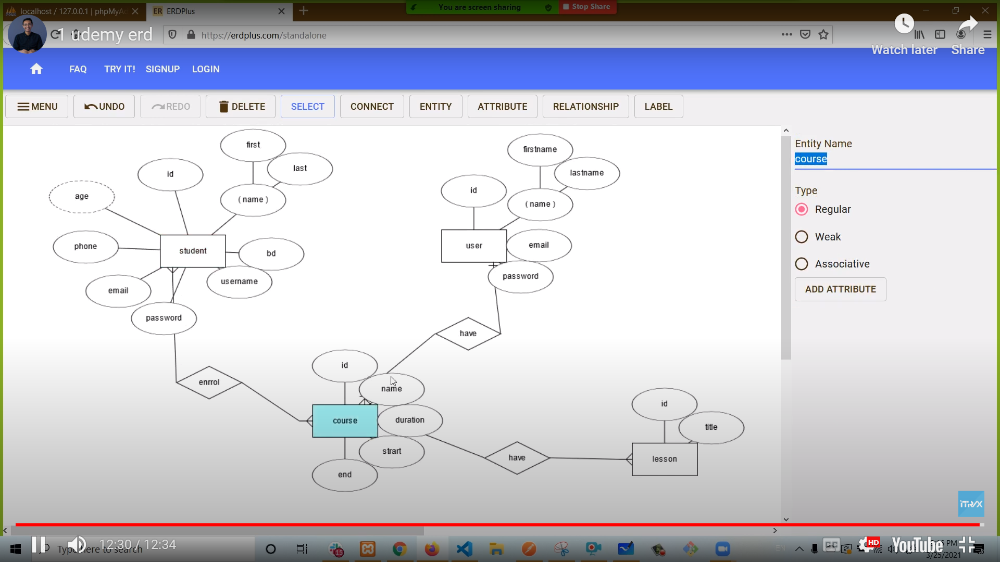
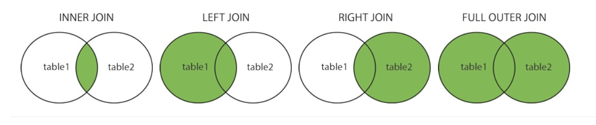
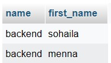
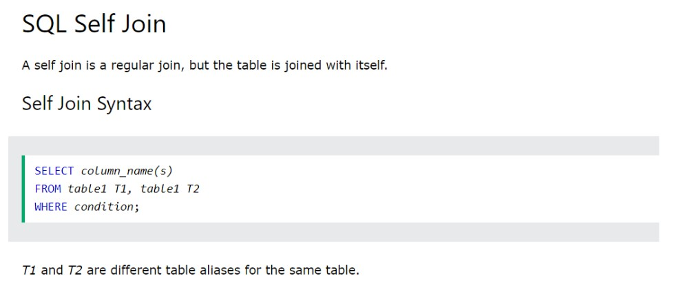
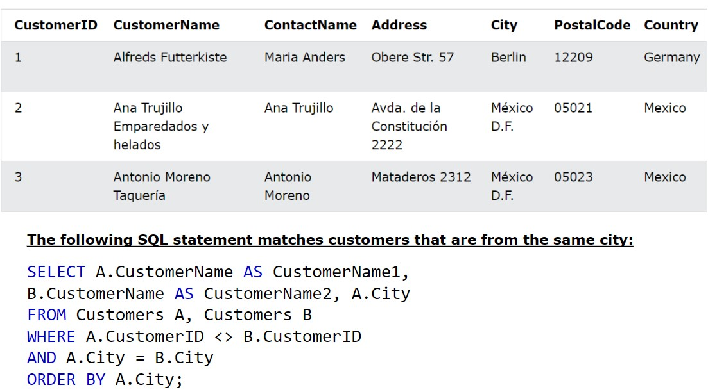

# ERD


## many to many
- take primary keys as foreign keys
- make both of them as primary key in the table that represent relationship to say that both of them are composite primary key for ralationship table
- ex: course(name,id), student(name,id), course_student(course_id,student_id,date)
    - if you make course_id and student_id as primary key in course_student table they are composite primary key of the new table(course_student), so if you enter same course for the same student it will give you erorr because you repeat primary key
# joins
- `(INNER) JOIN:` Returns records that have matching values in both tables
- `LEFT (OUTER) JOIN:` Returns all records from the left table, and the matched records from the right table
- `RIGHT (OUTER) JOIN:` Returns all records from the right table, and the matched records from the left table
- `FULL (OUTER) JOIN:` Returns all records when there is a match in either left or right table

## inner join
```sql
SELECT course.name, student.first_name FROM `course_student`
INNER JOIN student ON course_student.student_id = student.id 
INNER JOIN course ON course_student.course_id = course.id;
```

## group by
```sql
SELECT COUNT(CustomerID), Country
FROM Customers
GROUP BY Country;
```
# view
- In SQL, a view is a virtual table based on the result-set of an SQL statement.
- A view contains rows and columns, just like a real table. The fields in a view are fields from one or more real tables in the database.
- You can add SQL statements and functions to a view and present the data as if the data were coming from one single table.
```sql
CREATE VIEW [Brazil Customers] AS
SELECT CustomerName, ContactName
FROM Customers
WHERE Country = 'Brazil';
```
# the diffrence between where and having
- the WHERE clause is used for filtering individual rows
- the HAVING clause is used for filtering grouped and aggregated data.
# storage procudure
- like functions
- used to store quary and call it and pass parameters to it 
```sql
/*in routines*/
/*name: course_search*/
select * from course where name like concat('%',keyword_search,'%');
/* to call it  */
call course_search('f');
```
- see that video for more information [link](https://www.itraxacademy.com/home/lesson/full-stack-diploma/12/1114)
# trigger
- something will happen when other thing happen
- see that video for more information [link](https://www.itraxacademy.com/home/lesson/full-stack-diploma/12/1116)
___
___
___
# online  session notes
# offset
- ignore number of rows i select
- offset 2 ignore first 2
## using department_id `is equal to` department.department_id=employee.department_id
## self join

## union
- have the same number of columns
- columns must have the same data type
- columns in every select must be in the same order
## diffrence between union and union all
- union: select without diffrences
- union all: select with diffrences
## insert into select
- copy data from one table and insert it in new table
```sql
insert into customers(customer_name,city,country)
select supplierName,city,country from suppliers
```
## sql injection
- code techniques that might distroy my database
- web hacking techinique

## nice examples from session

- it will return 2 and 3


## session exercises
1. List the department names along with the employee's first name and last name.
```sql
SELECT departments.DEPARTMENT_NAME,employees.FIRST_NAME,employees.LAST_NAME FROM departments INNER JOIN employees USING (DEPARTMENT_ID);
```
2. List the names of employees and their managers names.
```sql
SELECT a.FIRST_NAME as employee, b.FIRST_NAME as manager FROM `employees` a, employees b WHERE a.EMPLOYEE_ID=b.MANAGER_ID;
```
3. list each region and it countries number
```sql
SELECT REGION_NAME, COUNT(COUNTRY_ID) FROM regions LEFT JOIN countries USING (REGION_ID) GROUP BY REGION_NAME;
```
4. Count the number of employees in each department.
```sql
SELECT DEPARTMENT_NAME, COUNT(EMPLOYEE_ID) FROM departments LEFT JOIN employees USING (DEPARTMENT_ID) GROUP BY DEPARTMENT_NAME;
```
5. list the departments which contains more than 3 employees. 
```sql
SELECT DEPARTMENT_NAME, COUNT(EMPLOYEE_ID) FROM departments LEFT JOIN employees USING (DEPARTMENT_ID) GROUP BY DEPARTMENT_NAME HAVING COUNT(EMPLOYEE_ID)>3;
```
6. get the total salary per department
```sql
SELECT DEPARTMENT_NAME, SUM(employees.SALARY) FROM departments LEFT JOIN employees USING (DEPARTMENT_ID) GROUP BY DEPARTMENT_NAME;
```
7. returns the minimum, maximum, and average salary of employees in each department.
```sql
SELECT DEPARTMENT_NAME, SUM(employees.SALARY),MIN(employees.SALARY),MAX(employees.SALARY) FROM departments LEFT JOIN employees USING (DEPARTMENT_ID) GROUP BY DEPARTMENT_NAME;
```

