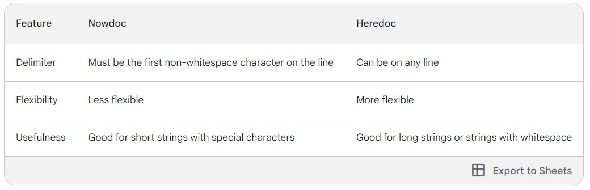

# php
## Type Juggling + Automatic Type Conversion
```php
echo 1 + "2"; // 3
echo '<br>';
echo gettype(1 + "2"); // Integer
echo '<br>';
echo True; // 1
echo '<br>';
echo gettype(True); // Boolean
echo '<br>';
echo True + True; // 2
echo '<br>';
echo gettype(True + True); // Integer
echo '<br>';
echo 5 + '5 Lessons'; // 10 => Warning
echo '<br>';
echo gettype(5 + '5 Lessons'); // Integer => Warning
echo '<br>';
echo 10 + 15.5; // 25.5
echo '<br>';
echo gettype(10 + 15.5); // double => Float
echo '<br>';
```
## cast
```php
echo 5 + (int)'5 lessons'  // it will return 10 without warning
```
## heredoc $ nowdoc
- we use it to write multible lines inside it and echo them as i write inside
```php
$string = <<< 'hello'
This is a heredoc string.
It spans multiple lines.
hello
echo $string
// it will return 
// This is a heredoc string.
// It spans multiple lines.
```
- we can use variables
```php
$name = 'salma';
echo <<< 'herdoc'
     a
      b
       c
        $name
     herdoc;  
/*
that will echo
a
 b
  c
   salma
*/
```
## nowdoc
```php
<<<'delimiter'
string content
delimiter
```

## assign by refrence
```php
$a=&$b
```
## flush 
- maybe cassed because after <?php ?> i make new line 
## magic constants
```php
echo __LINE__;
echo '<br>';
echo __FILE__;
echo '<br>';
echo __DIR__;
```
## print_r
- print array
- concatenat two arrays using +
```php
$arr1=[1=>'A',2=>'B'];
$arr2=[1=>'C',2=>'D'];

print_r($arr1+$arr2);
```
## diffrence between == &&& ====
`==`
- array compare two arrays by data in it 
- order not case diffrence
```php
$arr1=[1=>'1',2=>'1'];
$arr2=[1=>1,2=>1];
var_dump($arr1==$arr2);// return true
```
`===`
- === mean identical
- order case diffrence
- any changes will case diffrence
```php
$arr1=[1=>'1',2=>'1'];
$arr2=[1=>1,2=>1];
var_dump($arr1===$arr2);// return flase
```
## error control operator
```php
$b=@$a or die('variable not found'); // will not return error in case of errors
```