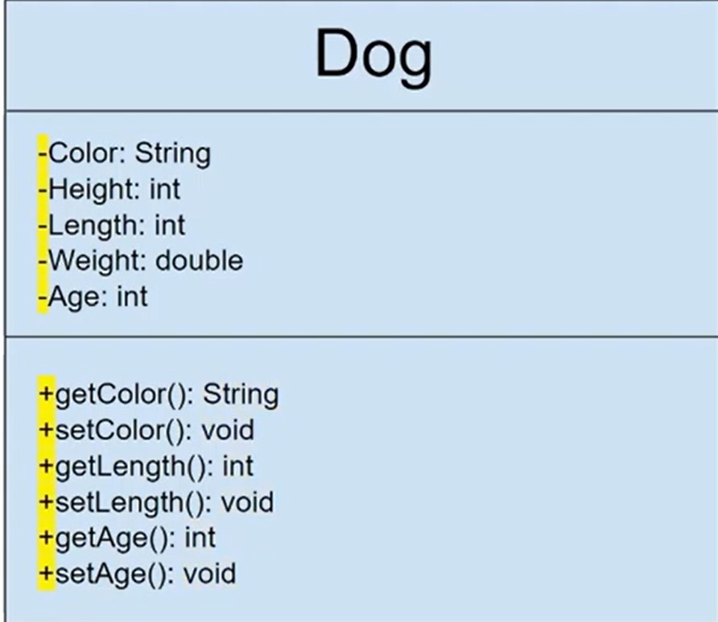

# Structural Diagrams:
1. **Composite Structure Diagram:**
   - Represents the internal structure of a class or component, showing how parts are connected.
   
2. **Deployment Diagram:**
   - Illustrates the physical components of a software system and their relationships.
   - Used to model the hardware and software deployment in a networked environment.

3. **Package Diagram:**
   - Displays packages and their dependencies within a system.
   - Useful for organizing and managing complex systems.

4. **Profile Diagram:**
   - Defines custom extensions and stereotypes to the UML to tailor it for specific domains or needs.

5. **Class Diagram:**
   - Essential for object-oriented programming (OOP).
   - Describes the types of objects in the system and their relationships.
   - It shows classes, attributes, operations, and associations.

6. **Component Diagram:**
   - Illustrates how different components interact with each other in a system.
   - Useful for representing the physical structure of the software.

### Behavioral Diagrams:
1. **Activity Diagram:**
   - Represents the workflow or processes within a system.
   - Used to model business processes, software algorithms, and more.

2. **Use Case Diagram:**
   - Describes the functional requirements of a system from a user's perspective.
   - Shows actors and their interactions with the system.

3. **State Machine Diagram:**
   - Models the behavior of an object or system in terms of states, transitions, and events.
   - Especially useful for modeling complex behaviors and state changes.

4. **Sequence Diagram:**
   - Depicts interactions between objects or components in a time-ordered sequence.
   - Shows the flow of messages between objects over time.

5. **Communication Diagram:**
   - Similar to a sequence diagram but focuses on object interactions without a strict time sequence.
   - Emphasizes the relationships and connections between objects.

6. **Interaction Overview Diagram:**
   - Provides a high-level view of the flow of control in interactions.
   - Combines various interaction diagrams (e.g., sequence, communication) to represent complex scenarios.

7. **Timing Diagram:**
   - Shows interactions and state changes over time.
   - Particularly useful for real-time systems, where timing and synchronization are crucial.

### Object Diagram:
- An instance of a class diagram, representing a snapshot of objects and their relationships at a specific point in time.

### Package Diagram:
- Describes the organization of the system into packages and their dependencies.

### Composite Structure Diagram:
- Depicts the internal structure of a class, showing its parts and how they connect.

### Profile Diagram:
- Defines stereotypes, tagged values, and constraints to customize the UML for specific domains or purposes.

# class diagram

- +, - and # 
   - +: means public 
   - -: means private
   - #: means protected
   - ~: means package local

## Conceptual Perspective:
- Focuses on the high-level, abstract view of a system, emphasizing understanding and communication.
- It is more about visualizing the overall structure and behavior without getting into detailed specifications.
- Often used for initial discussions, brainstorming, and to provide stakeholders with an easy-to-understand representation.
- It's less concerned with implementation details and more with conveying the system's concept.
- Diagrams from the conceptual perspective can include Use Case Diagrams, Class Diagrams, and Activity Diagrams.
- Useful for brainstorming, requirements gathering, and early design stages.

## Specification Perspective:
- Emphasizes the detailed and precise specifications of a system, including specific requirements, constraints, and technical details.
- Provides in-depth information for developers, helping them implement and understand the system accurately.
- It's more concerned with implementation, interfaces, and technical intricacies.
- Diagrams and models from the specification perspective can include Component Diagrams, Sequence Diagrams, State Machine Diagrams, and Deployment Diagrams.
- Important for documenting detailed design, software architecture, and technical specifications.
- Serves as a blueprint for the actual development and implementation of the system.

# Association
- 1:1
- 1:m
- n:m