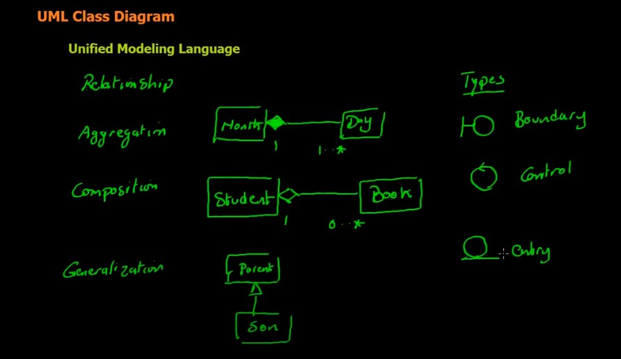
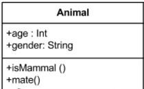
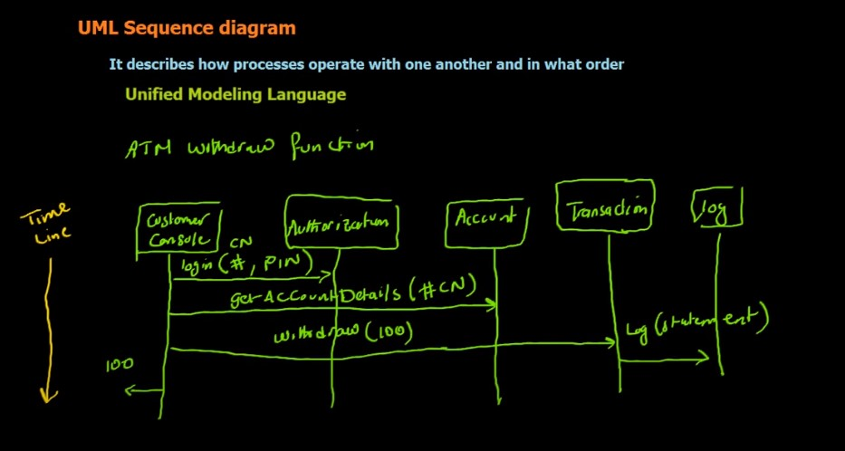
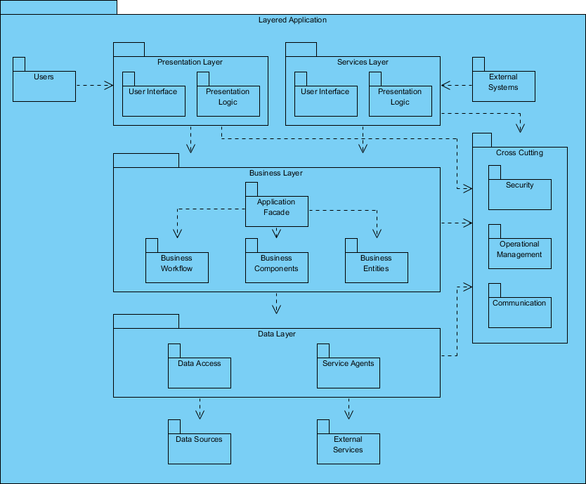
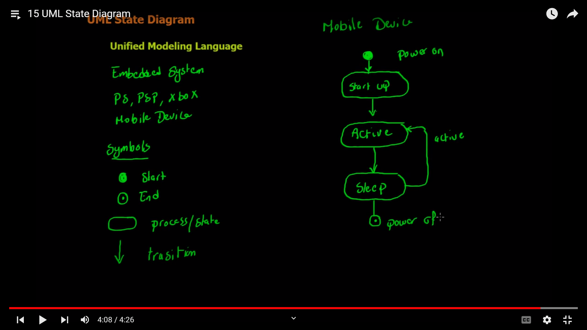

# uml class diagram

## aggreagation
- relation between 1 & 1...m

## composition
- relation between 1 & 0...m

## generalization 
- inheritance

# class diagram

- in that uml diagram:
    - (+) means public
    - (-) means private
    - (#) means protected

# use case diagram
.png)
- actors: people
- system: rectangle contain all operations
- operations: ovals

# sequence diagram

- provide clear way to understand how diffrent components or objects in system interact with each other 

# package diagram

# activity diagram

- concurence: from it we make two dicisions or we end two dicisions on it 

# state diagram

# diffrence between revese engineering and forward engineering
- forward: uml diagram to code
- reverse: code to uml diagram
- reverse enginnering can be done using netbeans